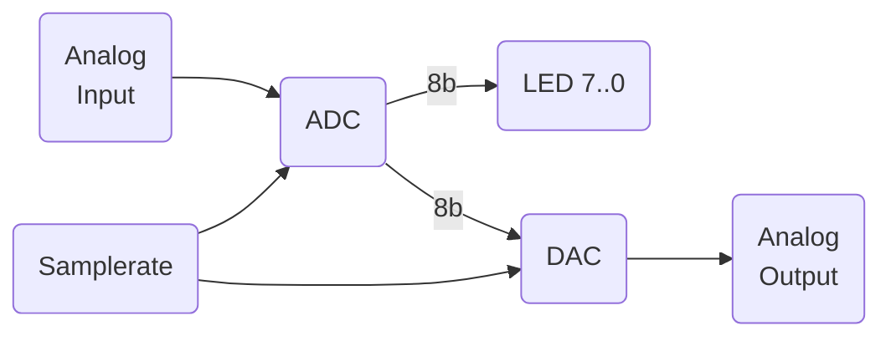

# ADDA Blinky

Demonstration of sampling and quantization concepts.

An analog input signal is applied to an 8-bit resolution analog-to-digital converter (ADC) that is sampling at a known rate.
The output bits are displayed on LEDs.
The data is also immediately applied to a digital-to-analog converter (DAC) at the same sample rate.

All of the features are implemented using an ATtiny1616 and its internal peripherals.
